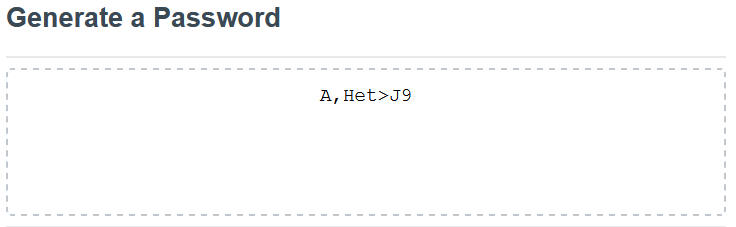

# Password Generator

## What is it?

This will ranomly generate a password given user prompted criteria. The prompts will ask for the ability to inlude special characters, numbers, uppercase letters, and lowercase letters. Then it will generate a random sequence to the character limit specified by the user using those character sets to generate a password for the user.

## Purpose

Allows the user to generate a random and unique password that can be used in any case a password may be necessary. Also allows the user to specify how unique and long the password should be

---

## How it works

>### Step One:
>
>To start you simply click the red "Generate Password" button or hit enter on the keyboard.
>
>

>### Step Two:
>
>Then it will begin to prompt the user. Each prompt will have a default value present. 
>
>
>
>The first prompt will be regarding the length of the password. It is limited between 8-128 characters and will reprompt the user if the number they enter is outside of that range[^1]. If an non-number character is entered into the prompt window, it will also reprompt the user[^2].

>### Step Three
>
>Next, you will be prompted with four more prompts requesting whether or not to include special, numeric, lowercase, and uppercase characters.
>
>
>
>From here the user can specify their prefrence by typing in an answer of "Yes", "Y", "No", "N", or they can click the blue "Okay" button or cancel button. If a value other than what is accepted is entered, the user will be prompted again until an appropriate answer is given[^3]

>### Step Four:
>
>Finally, after all prompts are answered, the user's generated password should appear in the center where it previously stated "Your Secure Password"
>
>
>
>The password can then be copied from the block by highlighting the text and copying it to the clipboard. The user can then, if needed, re-run the password generator by clicking the "Generate Password" button again, or hitting enter on their keyboard.

---

## Finished Product

Link to live [Password Generator](https://vidalatan.github.io/password_generator)

Link to [Code Repository](https://github.com/Vidalatan/password_generator)

---

#### Footnotes:
[^1]: The follow-up prompt for invalid input will display a message appropriate to how the user's answer fell out of range. For example, if the user enters a number less than the minimum value of 8, then the follow-up prompt will state that their input was too low.

[^2]: The follow-up prompt for invalid input will display a message appropriate to how the user included a non-number character.

[^3]: The follow-up prompt will display a generic message stating that the input was invalid.